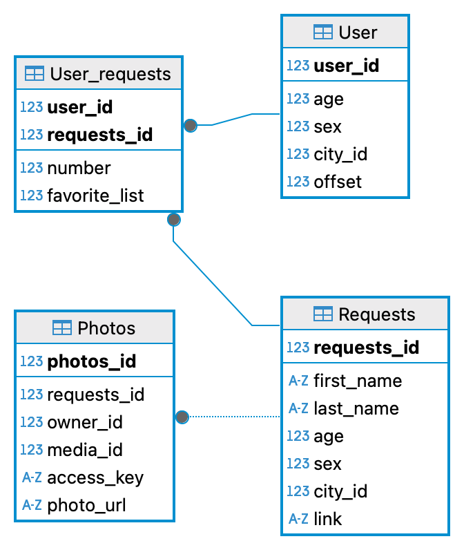

# VK App

Приложение помогает находить друзей в VK.


## Инструкция по общению с ботом

1. Отправьте любое сообщение в чат сообщества
2. Нажмите на кнопку Следующий, чтобы получить данные по следующему найденному аккаунту
3. Нажмите Добавить избранное, чтобы сохранить текущий аккаунт
4. Нажмите Показать избранное, чтобы посмотреть сохранённые аккаунты


## Инструкция по запуску бота

Заполните конфигурационный файл config.ini и запустите бот

```
[DATABASE]
driver=postgresql+pg8000
user=<user>
password=<password>
host=localhost
port=5432
database_name=<database_name>
auto_create=1
auto_remove=1

[VK_API]
user_token=<Your token>
group_token=<Your token>
```

user_token - пользовательский токен\
group_token - токен группы


## Описание модулей

- `main.py`: основной модуль, обеспечение запуска бота
- `messages.py`: отправка сообщений с помощью бота
- `config.py`: чтения конфигурационного файла
- `services.py`: работа с VK API и вызов методов обращение к базе данных
- `models.py`: ORM модели описания объектов базы данных
- `databases.py`: описание методов обращение к базе данных
- `content.py`: предоставление информационных сообщений в форме атрибутов класса


## Диаграмма базы данных



